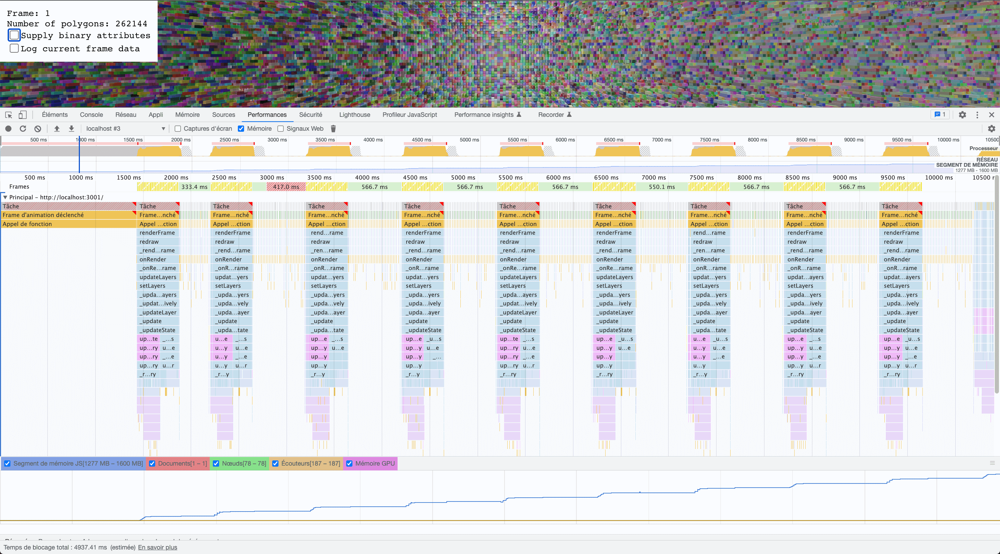
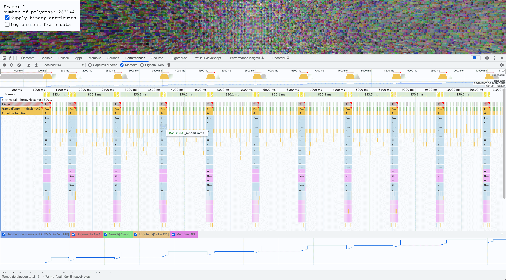

# deck.gl : binary attributes for maximum performance

(work in progress)

<https://deckgl-binary-attributes.vercel.app/>

## Layer

The deck.gl **SolidPolygonLayer** is used.

The layer coordinate system is set to cartesian coordinates, the grid size is 512x512.

Default cell size is 2, so 65536 polygons are created to fill the grid. Colors and elevation are randomly generated. It's possible to change the `cellSize` variable. Be careful, changing the cellSize from `2` to `1` multiplies polygons by 4, so 262144 polygons will be rendered.

In the dev tools screenshots below, `cellSize`was set to `1`.

The layer attributes are supplied in two ways, as an array of object and as binary attributes.

### Data property as array of objects (default)

`data` property is an array of objects, each object contains all data for one polygon : contour, color and elevation.

This data format is the most user-friendly.

```js
new SolidPolygonLayer({
  data: [
    {
      contour: [
        [x1, y1],
        [x1, y2],
        [x2, y2],
        [x2, y1],
        [x1, y1]
      ],
      color: [r, g, b, a],
      elevation: elevation
    }
    /* ... */
  ]
  /* ... */
});
```

The layer loops through each object and gets atttributes from methods: `getPolygon()`, `getFillColor()`, `getElevation()`.

```js
new SolidPolygonLayer({
  data: data,
  getPolygon: (d) => d.contour,
  getFillColor: (d) => d.color,
  getElevation: (d) => d.elevation
  /* ... */
});
```

### Data property as binary attributes

`data` property is an object which keys are `length` (number of polygons), `attributes` (binary attributes supplied as typed array), and `startIndices` (representing the start of each polygon).

Attributes must be supplied as typed arrays and `_normalize` property can be set to `false`.

```js
// generate new data
const data = getRandomData();

const polygons = new Float32Array(data.flatMap((d) => d.contour.flat()));

const colors = new Uint8Array(
  data.flatMap((d) => d.contour.flatMap((_) => d.color))
);

const elevations = new Uint8Array(
  data.flatMap((d) => d.contour.map((_) => d.elevation))
);

const polygonCount = data.length;

const startIndices = [];
for (let index = 0; index < polygons.length; index = index + 5) {
  startIndices.push(index);
}

// SolidPolygonLayer
new SolidPolygonLayer({
  data: {
    length: numberOfPolygons,
    startIndices: ,
    attributes: {
      // size: 2 = 1 point = [x,y]
      getPolygon: {
        value: polygons,
        size: 2
      },
      // size: 4 = 1 color = [r, g, b, a]
      getFillColor: { value: colors, size: 4 },
      // size: 1 = elevation
      getElevation: { value: elevations, size: 1 }
    }
  },
  _normalize: false
  /* ... */
})
```

## Performance optimization

According to deck.gl documentation (<https://pessimistress.github.io/deck.gl/docs/developer-guide/performance#use-binary-data>) :

> When creating data-intensive applications, it is often desirable to offload client-side data processing to the server or web workers.
> The server can send data to the client more efficiently using binary formats, e.g. protobuf, Arrow or simply a custom binary blob.
> Some deck.gl applications use web workers to load data and generate attributes to get the processing off the main thread. Modern worker implementations allow ownership of typed arrays to be transferred directly between threads at virtually no cost, bypassing serialization and deserialization of JSON objects.

> Supply attributes directly
> While the built-in attribute generation functionality is a major part of a Layers functionality, it can become a major bottleneck in performance since it is done on CPU in the main thread. If the application needs to push many data changes frequently, for example to render animations, data updates can block rendering and user interaction. In this case, the application should consider precalculated attributes on the back end or in web workers.
> Deck.gl layers accepts external attributes as either a typed array or a WebGL buffer. Such attributes, if prepared carefully, can be directly utilized by the GPU, thus bypassing the CPU-bound attribute generation completely.
> This technique offers the maximum performance possible in terms of data throughput, and is commonly used in heavy-duty, performance-sensitive applications.
> To generate an attribute buffer for a layer, take the results returned from each object by the get\* accessors and flatten them into a typed array.

Specific to SolidPolygonLayer (<https://pessimistress.github.io/deck.gl/docs/api-reference/layers/solid-polygon-layer#use-binary-attributes>) :

> Because each polygon has a different number of vertices, when data.attributes.getPolygon is supplied, the layer also requires an array data.startIndices that describes the vertex index at the start of each polygon. For example, if there are 3 polygons of 3, 4, and 5 vertices each (including the end vertex that overlaps with the first vertex to close the loop), startIndices should be [0, 3, 7, 12]. Polygons with holes are not supported when using precalculated attributes.
> Additionally, all other attributes (getFillColor, getElevation, etc.), if supplied, must contain the same layout (number of vertices) as the getPolygon buffer.
> To truly realize the performance gain from using binary data, the app likely wants to skip all data processing in this layer. Specify the \_normalize prop to skip normalization.

## Chrome dev tools, **Performance** tab




